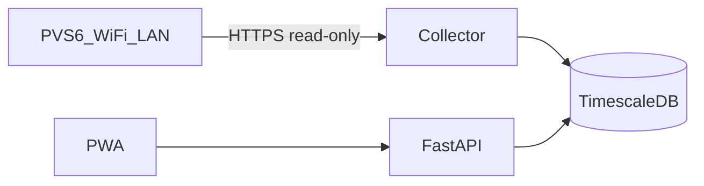

# Architecture

## Goal

Self-hosted monitoring for one residential SunPower PVS6 site: safe collection, durable history, mediated API, mobile-friendly UI. No cloud dependency for core operation.

## Current phase

**Phase 4 — PWA.** Nginx serves the React app on port **3080** and proxies `/api` to FastAPI.

### Build 61846 query shapes

Prefer flat matches observed on this site:

- `match=livedata`
- `match=meter` → `/sys/devices/meter/{id}/field`
- `match=inverter` → `/sys/devices/inverter/{id}/field`

Older nested `meter/data` / `inverter/data` examples returned HTTP 400 here.

## Target components

| Component | Choice | Role |
|-----------|--------|------|
| Collector | Python 3.12+ | Read-only PVS client, normalize measurements, enforce rate limits |
| Protocol adapters | `PvsDataSource` | `VarserverDataSource` (primary for build 61846), `LegacyDlCgiDataSource`, fixture/mock |
| Database | PostgreSQL + TimescaleDB | Time-series storage, aggregates, backups |
| API | FastAPI | REST history/config; SSE or WebSocket for live UI updates |
| UI | Responsive PWA | Phone-first charts, panel heatmap, health |
| Deploy | Docker Compose | Portable across Windows / Linux / later VPS+VPN |

## Deployment notes

- **This Windows PC (now):** Run Docker Compose; collector reaches `PVS_HOST` on the LAN.
- **DigitalOcean droplet (later):** A public VPS **cannot** poll a home Wi-Fi PVS without a private path. Options:
  1. Keep collector + DB on the home LAN; expose only the API via VPN.
  2. Run the full stack at home; optional remote UI over Tailscale/WireGuard.
  3. Do **not** port-forward the PVS6 or unauthenticated APIs to the internet.

## Data principles

- Timestamps stored in **UTC**; display in `America/Chicago`.
- Preserve source cumulative energy separately from estimated values.
- Idempotent ingestion; mark measured vs aggregated vs estimated.
- Configurable raw-payload retention for parser debugging.

## Protocol preference (firmware 61846)

Prefer SunStrong **authenticated varserver** (`/auth`, `/vars`) with **cached queries**. Use legacy `dl_cgi` only when necessary and at low frequency. Prefer event/stream interfaces only after evidence they are safe on this hardware and explicitly approved.

## Related ADRs

- [0001-architecture-choice.md](adr/0001-architecture-choice.md)
